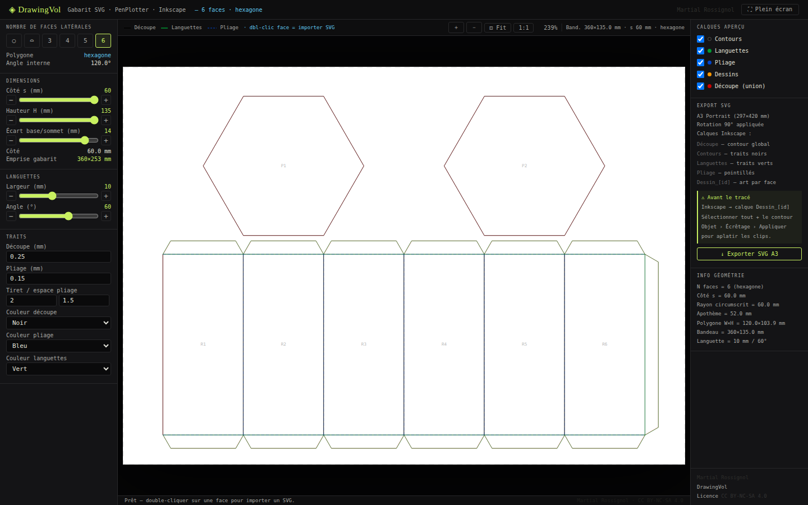

# DrawingVol — Gabarit SVG de prismes pour pen plotter

**[▶ Ouvrir DrawingVol](https://rossignol-martial.github.io/drawingvol/DrawingVol.html)**

**DrawingVol** est un outil web autonome (un seul fichier HTML) qui génère des gabarits SVG de volumes géométriques dépliés, optimisés pour le format A3, avec import de dessins vectoriels par face et export clippé prêt pour le pen plotter.



---

## Formes disponibles

| Bouton | Forme | Base | Dimensions par défaut |
|--------|-------|------|----------------------|
| ○ | Cylindre | Cercle | R=60 mm · H=133 mm |
| ⌓ | Vesica piscis | Amande | s=90 mm · H=147 mm |
| 3 | Prisme triangulaire | Triangle équilatéral | s=98 mm · H=255 mm |
| 4 | Prisme carré | Carré | s=90 mm · H=160 mm |
| 5 | Prisme pentagonal | Pentagone régulier | s=77 mm · H=135 mm |
| 6 | Prisme hexagonal | Hexagone régulier | s=60 mm · H=135 mm |

---

## Utilisation

1. Ouvrir `DrawingVol.html` dans un navigateur (Chrome ou Firefox recommandé)
2. Choisir la forme avec les boutons ○ ⌓ 3 4 5 6
3. Ajuster les dimensions avec les sliders
4. Double-cliquer sur une face pour importer un SVG
5. Ajuster la position et le zoom du dessin
6. Cliquer sur **↓ Exporter SVG A3**

L'export calcule l'intersection vectorielle (Sutherland-Hodgman) de chaque dessin avec sa face — aucun débordement, paths purs directement traçables par le pen plotter.

---

## Workflow pen plotter

```
DrawingVol → Export SVG → Inkscape → Traceur (AxiDraw, etc.)
```

Le SVG exporté contient des calques Inkscape séparés :
- **Découpe** — contour extérieur (rouge) — pour la machine de découpe
- **Contours** — traits noirs des faces
- **Languettes** — trapèzes de collage (vert)
- **Pliage** — pointillés de pliage (bleu)
- **Dessins** — paths vectoriels clippés, prêts pour le tracé

---

## Cylindre et Vesica — languettes en peigne

Pour le cylindre et la vesica piscis, le bord supérieur et inférieur du bandeau est découpé en **peigne de languettes** (~37 languettes de 10 mm) permettant le collage sur les bases courbes.

L'angle des languettes est réglable via le slider **Angle (°)**.

---

## Caractéristiques techniques

- **Fichier unique** — aucune dépendance externe, fonctionne hors ligne
- **Export vectoriel** — clipping Sutherland-Hodgman dans le navigateur (thread `requestAnimationFrame`)
- **Calques Inkscape** — compatibles Inkscape 1.x
- **Format A3 portrait** — 297×420 mm, rotation 90° appliquée
- **Support SVG** — viewBox, transformations, groupes imbriqués, courbes de Bézier (C, Q, A)

---

## Documentation

Le fichier `DrawingVol-mode-emploi.pdf` contient le manuel complet (7 sections, ~40 pages) avec captures d'écran, schémas géométriques et exemples pen plotter.

---

## Licence

© Martial Rossignol — Licence [CC BY-NC-SA 4.0](https://creativecommons.org/licenses/by-nc-sa/4.0/)

Utilisation personnelle et non commerciale autorisée avec attribution.
